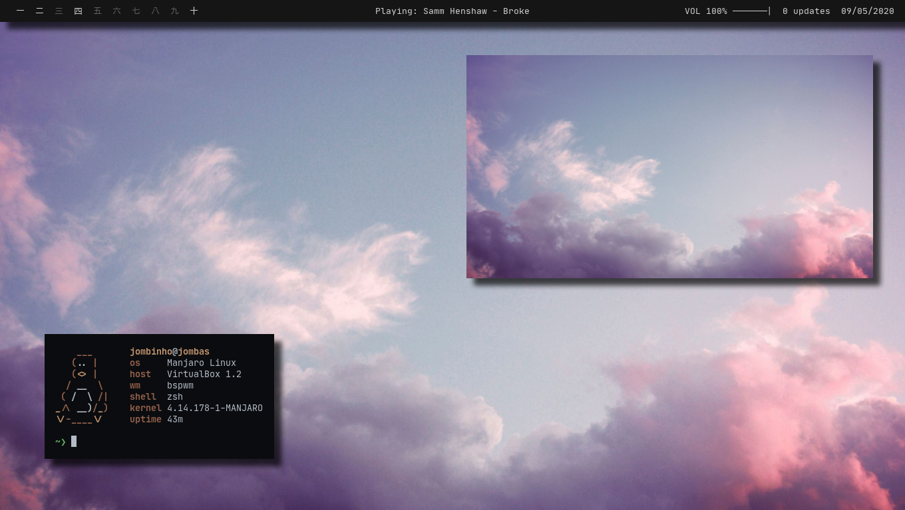

<!-- <h1 align="center">Dotfiles do Jomba</h1>

## [Br] Sistema / [En] System

+  **WM:** [bspwm](https://github.com/baskerville/bspwm)
+  **Bar:** [polybar](https://github.com/polybar/polybar)
+  **Application launcher:** [rofi](https://github.com/davatorium/rofi) 
+  **Compositor:** [picom](https://github.com/yshui/picom)
+  **Notifications:** [dunst](https://github.com/dunst-project/dunst)
+  **Terminal:** [kitty](https://github.com/kovidgoyal/kitty)
+  **Cursor:** [dark hackneyed](https://gitlab.com/Enthymeme/hackneyed-x11-cursors/-/tags/0.8)

## [Br] Desenvolvimento de software / [En] Development
+  **Editor:**  [Code](https://github.com/Microsoft/vscode)

## [Br] Dependências / [En] Dependencies

+  **JetBrainsMono Font:** [Github](https://github.com/ryanoasis/nerd-fonts/tree/master/patched-fonts/JetBrainsMono)/[Aur](https://aur.archlinux.org/packages/nerd-fonts-jetbrains-mono/)
+  **TakaoGothic Font:** [Url](https://launchpad.net/takao-fonts)/[Aur](https://aur.archlinux.org/packages/otf-takao/)
+  **Playerctl:** [Github](https://github.com/altdesktop/playerctl)
+  **PulseAudio:** [Url](https://www.freedesktop.org/wiki/Software/PulseAudio/)

## [Br] Outro / [En] Other

+  **Music:** [Spotify](https://www.spotify.com/)
+  **Browser:** [Firefox](https://www.mozilla.org/en-US/firefox/new/)
+  **File Manager:** [Thunar](https://github.com/xfce-mirror/thunar)
+  Comunicação **S I N I S T R A**: [Discord](https://discordapp.com/) and [Telegram](https://telegram.org/) -->
Work in Progress
